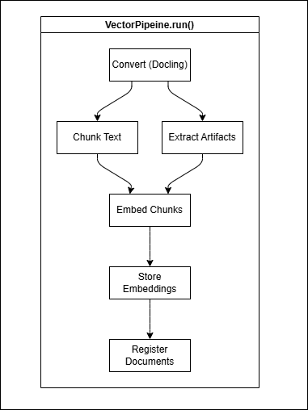
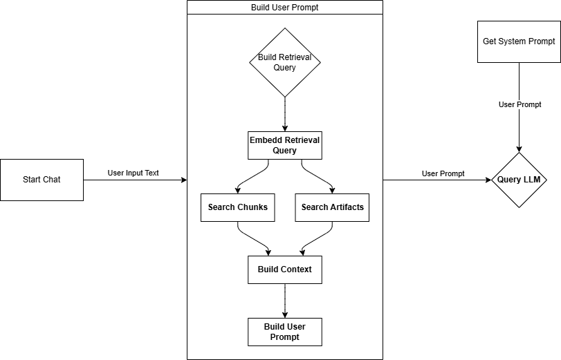

// ...existing code...
# Vector

[](#) [](LICENSE) [](#)

## Table of Contents
- Overview
- Features
- Quick Start (Minimal)
- Installation
  - Local Qdrant
  - Configuring Qdrant (Local vs Remote)
- Configuration
- Architecture
  - Core Pipeline
  - Agent Pipeline
- Data & Storage Layout
- Limitations
- Roadmap
- Testing & Development
- Contributing
- License

## Overview
Vector is a research tool that ingests documents (text, tables, figures), extracts structured chunks and artifacts, and uses a Retrieval-Augmented Generation (RAG) pipeline (Docling + Qdrant) to answer questions with grounded citations—useful for any domain where traceability to original sources matters (regulatory, legal, engineering, scientific, policy, internal knowledge, and more).

## Features
- Multi-format ingestion (PDF, DOCX, PPTX, HTML, MD, CSV, images, Docling JSON)
- Relevant figures and tables returned alongside responses
- Search across multiple documents simultaneously
- Tag-based document filtering
- Provider-agnostic model configuration
- Gradio web UI + CLI + Python API

## Quick Start (Minimal)
```bash
git clone <repo>
cd vector
pip install -e .
copy .env.example .env
# set OPENAI_API_KEY
docker run -p 6333:6333 qdrant/qdrant:latest
python -m vector.core.ingest ./samples/zoning.pdf
python -m vector.agent search "corner lot setback"
```

Programmatic:
```python
from vector.core.pipeline import VectorPipeline
from vector.agent.api import Agent

pipeline = VectorPipeline()
doc_id = pipeline.run("samples/zoning.pdf", tags=["zoning"])
agent = Agent()
print(agent.answer("Summarize R-1 height limits", top_k=6))
```

## Installation
Requirements: Python 3.10+, Qdrant (local or remote), ~2GB disk for embeddings (sample scale).
Optional: GPU for Sentence Transformers acceleration.

### Local Qdrant
```bash
docker run -d --name qdrant -p 6333:6333 qdrant/qdrant:latest
```

### Configuring Qdrant (Local vs Remote)

Vector prefers an explicit configuration via `config.yaml` (auto-created on first run if missing). Relevant section excerpt:

```yaml
vector_database:
  # Cloud Storage
  url: null          # Set to remote Qdrant base URL OR set to null if using local
  api_key: null      # Use env var QDRANT_API_KEY instead of hard-coding

  # Local Storage
  local_path: "./qdrant_db"  # Used when url is null (embedded/local)
```

Usage modes:
1. Local embedded (default): leave `url: null`; Vector will use the directory at `local_path`.
2. Remote managed Qdrant: set `url` (e.g. `https://YOUR-INSTANCE-region.aws.cloud.qdrant.io:6333`) and export `QDRANT_API_KEY`.

Set environment variable for remote:
```powershell
$Env:QDRANT_API_KEY = "your_cloud_qdrant_api_key"
```

Or in `.env`:
```
QDRANT_API_KEY=your_cloud_qdrant_api_key
```

If both `api_key` in file and `QDRANT_API_KEY` env are present, the environment variable should take precedence (recommended best practice). Remove any stale Docker Compose references; a single-container Qdrant can still be run via the earlier `docker run` command when you want a clean local instance.

## Configuration
Primary configuration lives in config.yaml at the project root. Edit that file instead of relying on many environment variables.

## Architecture
High-level:
- Core: deterministic ingestion → Docling parse → chunk + artifact extraction → embeddings → Qdrant
- Agent: query expansion → dual collection retrieval → ranking → prompt assembly → LLM answer
- Web: Gradio UI wrapping Core + Agent APIs

### Core Pipeline
After conversion, the pipeline does two passes:

1. Chunk pass: Docling’s hybrid chunker splits the document into readable text chunks and keeps references (self_ref ids) to any tables or figures mentioned. These references are stored as metadata.
2. Artifact pass: It walks the full Docling document, exports each referenced table or figure as a PNG (plus a thumbnail), and builds an Artifact record (caption, headings, a little surrounding text, file paths). 

Each artifact is linked back to any chunk that referenced it. This lets you search:
- By text chunks (richer narrative context), or
- By artifacts (focused tables/figures), or
- Merge both for better coverage.

Both forms are kept intentionally. Finally, the system:
- Embeds chunks and artifacts
- Writes them into their Qdrant collections
- Registers the document (metadata, counts, tags, collection names) in the registry.
  

### Agent Pipeline




## Data & Storage Layout
```
data/
  documents/<doc_id>.json
  artifacts/<doc_id>/<artifact_id>.png
  artifacts/<doc_id>/thumb_<artifact_id>.png
registry/ (metadata store, e.g., document_registry.json)
```

## Limitations
- In-memory chat session store (not persisted)
- Limited artifact OCR if figures contain dense text
- No streaming answers yet

## Roadmap
- Persistent session storage (SQLite or Redis)


## Testing & Development
```bash
python -m venv .venv
.\.venv\Scripts\activate
pip install -e ".[dev]"
pytest -q
ruff check .
```

## Contributing
PRs welcome. Open an issue describing enhancement before large changes.

## License

Licensed under the Apache License, Version 2.0 (the "License"); you may not use this project except in compliance with the License. A copy of the License is provided in the `LICENSE` file and is also available at:

http://www.apache.org/licenses/LICENSE-2.0

Unless required by applicable law or agreed to in writing, software distributed under the License is distributed on an "AS IS" BASIS, WITHOUT WARRANTIES OR CONDITIONS OF ANY KIND, either express or implied. See the License for the specific language governing permissions and limitations under the License.

Copyright (c) 2025 Vector Team

This project may include third-party components; attribution notices (if any) are included in the `NOTICE` file. When creating derivative works, please preserve existing attribution and clearly mark any changes you make.


