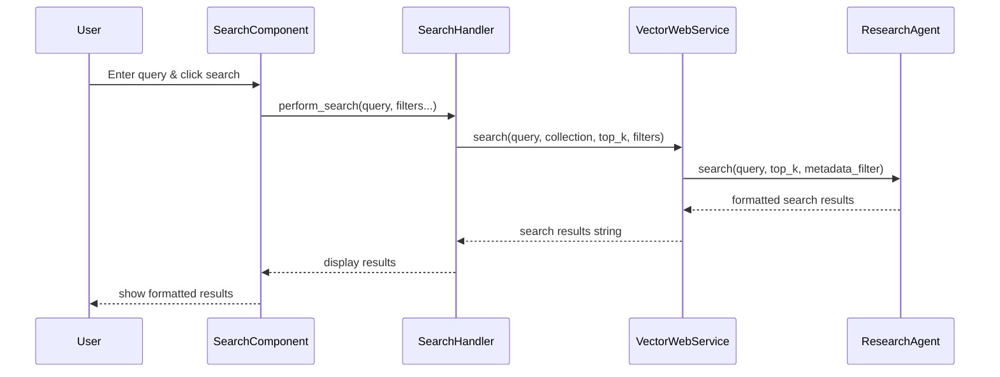

# Vector Web Application Architecture

## Overview

The Vector web application is built using Gradio and follows a clean separation of concerns across three main modules: **Services**, **Components**, and **Handlers**. This architecture promotes maintainability, testability, and scalability.

## 📋 Architecture Pattern

```
┌─────────────────┐    ┌──────────────────┐    ┌─────────────────┐
│   Components    │    │     Handlers     │    │    Services     │
│  (UI Elements)  │◄───┤ (Event Logic)   │◄───┤ (Business Logic)│
└─────────────────┘    └──────────────────┘    └─────────────────┘
        │                       │                       │
        ▼                       ▼                       ▼
   Gradio UI              Event Routing           Core/Agent APIs
```

## 🏗️ Services Layer (`service.py`)

### Purpose
The services layer encapsulates all business logic and external API interactions. It acts as a bridge between the web interface and the core Vector functionality.

### Key Responsibilities
- **Business Logic**: Document processing, search, AI queries
- **Data Management**: Collection management, metadata handling
- **External APIs**: Integration with core modules and AI services
- **State Management**: Caching agents and processors per collection
- **Error Handling**: Converting exceptions to user-friendly messages

### Main Class: `VectorWebService`

#### Core Methods

| Method | Description | Returns |
|--------|-------------|---------|
| `get_collections()` | Retrieve all available collections | `List[str]` |
| `search()` | Perform document search with filters | `str` (formatted results) |
| `ask_ai()` | Ask AI questions about documents | `str` (AI response) |
| `process_documents()` | Upload and process new documents | `str` (processing status) |
| `get_collection_info()` | Get collection statistics and metadata | `str` (formatted info) |
| `delete_documents()` | Remove documents by filename | `str` (deletion status) |
| `create_collection()` | Create new document collection | `str` (creation status) |
| `rename_collection()` | Rename existing collection | `str` (rename status) |
| `delete_collection()` | Delete entire collection | `str` (deletion status) |

#### Key Features
- **Agent Caching**: Maintains `ResearchAgent` instances per collection
- **Processor Caching**: Reuses `DocumentProcessor` instances for efficiency
- **Metadata Management**: Provides filter options based on document metadata
- **Error Translation**: Converts technical errors to user-friendly messages

---

## 🎨 Components Layer (`components.py`)

### Purpose
The components layer defines reusable UI elements and layouts. Each component function returns Gradio elements that can be composed into larger interfaces.

### Key Responsibilities
- **UI Construction**: Creating Gradio interface elements
- **Layout Definition**: Organizing components into logical groups
- **Styling**: Applying CSS classes and styling
- **Component Configuration**: Setting up interactive elements and their properties

### Main Component Functions

#### Layout Components
```python
def create_header() -> gr.HTML
def create_collection_selector() -> Tuple[gr.Dropdown, gr.Button]
def create_metadata_filters() -> Tuple[gr.Dropdown, gr.Dropdown, gr.Dropdown, gr.Button]
```

#### Tab Components
```python
def create_search_tab() -> Dict[str, gr.Component]
def create_upload_tab() -> Dict[str, gr.Component]  
def create_info_tab() -> Dict[str, gr.Component]
def create_management_tab() -> Dict[str, gr.Component]
def create_delete_tab() -> Dict[str, gr.Component]
```

#### Component Features
- **Consistent Styling**: Uses CSS classes and element IDs for theming
- **Accessibility**: Proper labels and semantic HTML structure
- **Responsive Design**: Scales appropriately across different screen sizes
- **Return Structure**: Returns dictionaries mapping component names to Gradio elements

#### Example Component Structure
```python
def create_search_tab() -> Dict[str, gr.Component]:
    """Create the Search & Ask tab with AI and search functionality."""
    
    components = {}
    
    with gr.TabItem("🔍 Search & Ask"):
        with gr.Tabs():
            # Ask AI Tab
            with gr.TabItem("🤖 Ask AI"):
                components['ask_query'] = gr.Textbox(...)
                components['ask_btn'] = gr.Button(...)
                components['ai_response'] = gr.Textbox(...)
            
            # Search Tab  
            with gr.TabItem("🔍 Search Documents"):
                components['search_query'] = gr.Textbox(...)
                components['search_btn'] = gr.Button(...)
                components['search_results'] = gr.Textbox(...)
    
    return components
```

---

## ⚡ Handlers Layer (`handlers.py`)

### Purpose
The handlers layer manages event routing and user interactions. It connects UI components to service methods and handles user input validation.

### Key Responsibilities
- **Event Routing**: Connecting UI events to appropriate service methods
- **Input Validation**: Ensuring user inputs are valid before processing
- **State Management**: Managing UI state changes and updates
- **Error Handling**: Displaying user-friendly error messages
- **Data Transformation**: Converting between UI formats and service formats

### Main Handler Functions

#### Core Event Handlers
```python
def perform_search(query, top_k, collection, filters...) -> str
def ask_ai(question, length, collection, filters...) -> str  
def process_files(files, collection, source, force) -> str
def get_info(collection) -> str
def delete_documents(filenames, collection) -> str
```

#### Management Handlers
```python
def create_new_collection(name, description) -> str
def rename_collection(old_name, new_name) -> str  
def delete_collection(name) -> str
def refresh_collections() -> List[str]
```

#### Filter and Utility Handlers
```python
def update_metadata_filters(collection) -> Tuple[List, List, List]
def build_metadata_filter(filenames, sources, headings) -> Optional[Dict]
def toggle_collection_mode(mode) -> gr.Textbox
```

#### Main Connection Function
```python
def connect_events(web_service, collection_dropdown, refresh_btn, 
                  search_components, upload_components, info_components,
                  management_components, delete_components,
                  filename_filter, source_filter, heading_filter, update_btn):
    """Connect all UI components to their respective event handlers."""
```

### Handler Pattern
Each handler follows a consistent pattern:

1. **Input Validation**: Check for empty or invalid inputs
2. **Service Call**: Invoke appropriate service method
3. **Response Formatting**: Format response for UI display
4. **Error Handling**: Catch and format any errors

#### Example Handler
```python
def perform_search(web_service, query, top_k, collection, 
                  selected_filenames, selected_sources, selected_headings):
    """Handle document search with metadata filters."""
    
    # Build metadata filter
    metadata_filter = build_metadata_filter(
        selected_filenames, selected_sources, selected_headings
    )
    
    # Call service
    return web_service.search(query, collection, int(top_k), metadata_filter)
```

---

## 🔄 Data Flow

### Typical Request Flow
1. **User Interaction**: User clicks button or enters input in a Component
2. **Event Trigger**: Gradio triggers the connected Handler function  
3. **Input Processing**: Handler validates and processes user input
4. **Service Call**: Handler calls appropriate Service method
5. **Business Logic**: Service executes business logic using core modules
6. **Response Processing**: Service formats response for UI display
7. **UI Update**: Handler returns response to update Component display

### Example: Document Search Flow


---

## 🎯 Benefits of This Architecture

### Separation of Concerns
- **Components**: Focus purely on UI structure and layout
- **Handlers**: Focus on event logic and user interaction
- **Services**: Focus on business logic and external integrations

### Maintainability  
- **Modular Design**: Each layer can be modified independently
- **Clear Interfaces**: Well-defined contracts between layers
- **Single Responsibility**: Each function has one clear purpose

### Testability
- **Unit Testing**: Each layer can be tested in isolation
- **Mock Services**: Handlers can be tested with mock services
- **Component Testing**: UI components can be tested independently

### Scalability
- **Easy Extension**: New features can be added to appropriate layers
- **Code Reuse**: Components and handlers can be reused across features
- **Performance**: Service caching optimizes repeated operations

### Developer Experience
- **Clear Structure**: Easy to find and modify specific functionality
- **Consistent Patterns**: Similar code structure across all features
- **Documentation**: Self-documenting through clear naming and structure

---

## 📁 File Structure

```
vector/web/
├── __init__.py          # Package initialization
├── styles.css           # CSS styling for components
├── main.py             # Entry point & app creation (75 lines)
├── service.py          # VectorWebService class (280 lines)
├── components.py       # UI components (310 lines)  
├── handlers.py         # Event handlers (200 lines)
└── ARCHITECTURE.md     # This documentation file
```

## 🚀 Getting Started

### Running the Application
```bash
# From the project root
python vector_web.py
```

### Adding New Features

1. **Add UI Components** in `components.py`:
   ```python
   def create_new_feature_tab():
       # Create UI elements
       return components_dict
   ```

2. **Add Event Handlers** in `handlers.py`:
   ```python
   def handle_new_feature(web_service, input_data):
       # Process input and call service
       return web_service.new_feature_method(input_data)
   ```

3. **Add Business Logic** in `service.py`:
   ```python
   def new_feature_method(self, input_data):
       # Implement business logic
       return processed_result
   ```

4. **Connect Everything** in `main.py`:
   ```python
   # Add to create_vector_app()
   new_feature_components = create_new_feature_tab()
   # Connect in connect_events()
   ```

This architecture makes it easy to add new features while maintaining clean separation of concerns and code organization.